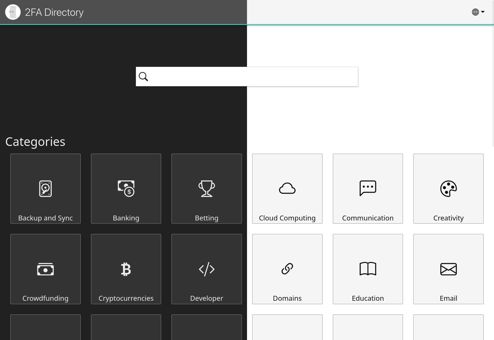

# 2FA.Directory Frontend

> **Note**
> This repository contains a proposed redesign of [2fa.directory](https://2fa.directory/).  
> Until it is approved as the official design, the project is accessible
> via [beta.2fa.directory](https://beta.2fa.directory/).

This repository contains the HTML, JavaScript and CSS for [2fa.directory](https://2fa.directory/).  
All data used to populate the categories is located
in [2factorauth/twofactorauth](https://github.com/2factorauth/twofactorauth.git).

## Local installation

The website is based on the static site generator [Hugo](https://gohugo.io/).
To build locally you will need to follow the [installation instructions](https://gohugo.io/installation/) for Hugo.  
[Ruby](https://www.ruby-lang.org/en/documentation/installation/) is also required for some scripts.

After you've installed Hugo and Ruby, follow these steps to build the site locally:

1. Install NPM packages
   `npm install`
1. Install Ruby gems
   `bundle install`
1. Fetch entries:
   `./generate_entries.rb`
1. Generate regional pages:
   `./generate_regions.rb`
1. Run Hugo locally:
   `hugo serve`

The site should then be reachable at [127.0.0.1:1313](http://127.0.0.1:1313/).
> **Note**
> The [region-redirection](/functions/redirect.js) script does not run locally. You will therefore always be directed to
> the international page when using `hugo serve`.

## Contributing

When contributing changes to this repository, please make sure your IDE follows
our [editorconfig](https://editorconfig.org/).

The general file structure is as follows:

|     Type     | Path                  |
|:------------:|-----------------------|
|  JavaScript  | `assets/js`           |
|     CSS      | `assets/css`          |
|   Layouts    | `layouts/_default`    |
|    Pages     | `content`             |
| Translations | `data/languages.json` |

## License

This project is licensed under GPLv3. For the entire license see [LICENSE](/LICENSE).

Before you make changes to the code, please keep the following in mind:

* The data is [licensed separately](https://github.com/2factorauth/twofactorauth/blob/master/LICENSE.md).
* Attribution is required if you use this project as a template for your own website.
* The initial contents of [LICENSE](/LICENSE) must still be included in distributions and forks but we allow (and
  encourage) you to prepend your own copyright and GPLv3-compatible license for changes you make.

For a more information on what is and isn't allowed under a GPLv3 license, see
this [guide](https://www.gnu.org/licenses/quick-guide-gplv3.html).
